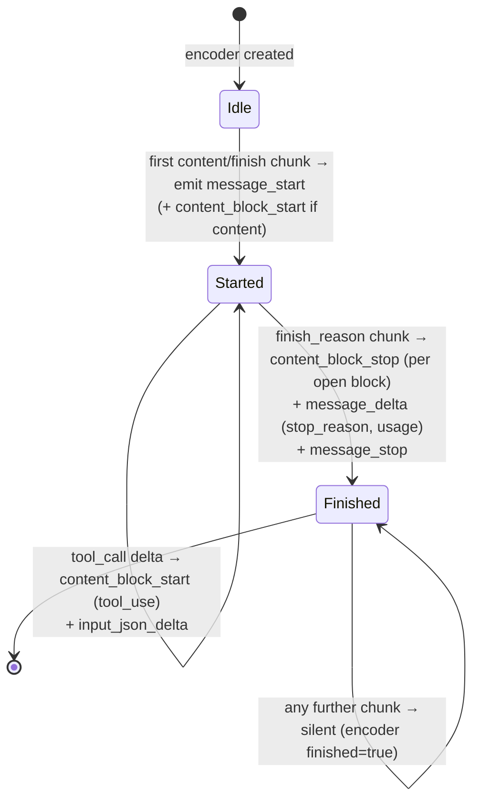

# Protocol Translation

The gateway has to make a single inbound contract — Anthropic's
[`POST /v1/messages`](https://docs.anthropic.com/en/api/messages)
— work against four-plus upstream providers whose wire shapes
disagree on almost every level: request body, header style, tool
schema, streaming event format, even the name of "the reason the
generation stopped". Doing this without losing fidelity to the
inbound spec is the work of one module, `messages.rs`, and one
state machine, `AnthropicSseEncoder`.

This page walks through both halves of the design:

- The **byte-passthrough path** that runs when the resolved
  upstream is Anthropic itself — preserves features the
  gateway-internal IR cannot losslessly round-trip
  (`cache_control`, `thinking` blocks, image blocks).
- The **cross-provider synthesis path** that runs when the
  upstream is OpenAI / Gemini / DeepSeek — translates the inbound
  Anthropic body to the internal `ChatFormat`, dispatches through
  a `Bridge`, and re-encodes the response as Anthropic JSON or
  Anthropic SSE.

Both paths share auth, model resolution, access-log emission,
metrics labels, and health-tracker hooks. The branch happens at
exactly one site.

## Where the branch happens

```mermaid
flowchart LR
  client(["Client<br/>(Anthropic SDK)"]) -->|POST /v1/messages| handler[messages::messages]
  handler --> resolve[Resolve Model<br/>via snapshot]
  resolve --> branch{model.provider<br/>== Anthropic?}

  branch -->|yes| pass[Byte-passthrough<br/>messages.rs:189-349]
  branch -->|no| cross[cross_provider_dispatch<br/>messages.rs:405]

  pass -->|reqwest bytes_stream| upstream_a[(Anthropic<br/>/v1/messages)]
  upstream_a -.->|SSE bytes verbatim| client

  cross --> parse[parse_inbound_request<br/>→ ChatFormat]
  parse --> hub[Hub.get(provider)]
  hub --> bridge[Bridge::chat / chat_stream]
  bridge --> upstream_x[(OpenAI / Gemini /<br/>DeepSeek)]
  upstream_x --> encoder[AnthropicSseEncoder<br/>state machine]
  encoder -.->|message_start<br/>content_block_*<br/>message_delta<br/>message_stop| client
```

The entry handler
([`crates/aisix-proxy/src/messages.rs:45-136`](https://github.com/api7/ai-gateway/blob/main/crates/aisix-proxy/src/messages.rs#L45))
parses the body, resolves the model, runs auth and quota, and
hits the branch at
[`messages.rs:176`](https://github.com/api7/ai-gateway/blob/main/crates/aisix-proxy/src/messages.rs#L176):

```rust
if model.provider != Some(Provider::Anthropic) {
    return cross_provider_dispatch(...).await;
}
```

Anything beyond this line is the passthrough path; the
cross-provider path is the function it tail-calls.

## Path A: Anthropic byte-passthrough

When the upstream is Anthropic, the goal is to **not parse the
response body at all**. The gateway-internal `ChatFormat` is a
designed compromise — it has to be representable across OpenAI,
Gemini, and DeepSeek wire shapes — and the round-trip loses
fields that Anthropic-only customers actually use:

- `cache_control` markers (prompt-caching feature)
- `thinking` content blocks (extended-thinking models)
- raw `tool_use` / `image` content blocks beyond the text subset
- request fields like `metadata.user_id`, `top_k`,
  `stop_sequences`

So we deliberately keep this path "dumb":

1. **Rewrite only the `model` field** to the upstream id
   ([`messages.rs:193-196`](https://github.com/api7/ai-gateway/blob/main/crates/aisix-proxy/src/messages.rs#L193))
   — every other body field flows through unchanged.
2. **Inject Anthropic-specific headers**
   ([`messages.rs:212-218`](https://github.com/api7/ai-gateway/blob/main/crates/aisix-proxy/src/messages.rs#L212)):

   ```rust
   .header("x-api-key", api_key)
   .header("anthropic-version", "2023-06-01")
   .header("content-type", "application/json")
   .header("x-aisix-request-id", request_id)
   ```

   Notice `x-api-key` rather than `Authorization: Bearer` —
   Anthropic's auth scheme is non-OAuth and an SDK that sends
   the wrong header gets a 401 on the very first request. The
   constant `ANTHROPIC_VERSION = "2023-06-01"`
   ([`messages.rs:43`](https://github.com/api7/ai-gateway/blob/main/crates/aisix-proxy/src/messages.rs#L43))
   matches the value Anthropic's own SDKs emit; pinning the
   version centrally lets the gateway upgrade everyone at once.

3. **Stream bytes verbatim**
   ([`messages.rs:273-281`](https://github.com/api7/ai-gateway/blob/main/crates/aisix-proxy/src/messages.rs#L273)):

   ```rust
   if is_stream {
       let headers = upstream_resp.headers().clone();
       let body_stream = upstream_resp.bytes_stream();
       let mut response = axum::response::Response::new(
           axum::body::Body::from_stream(body_stream),
       );
       // copy content-type, cache-control, etc.
       ...
   }
   ```

   No SSE parser, no event-by-event re-emission. The upstream's
   `text/event-stream` bytes ride out to the client byte-for-byte.

The trade-off is honest: usage metrics for the Anthropic
passthrough are best-effort — see
[`messages.rs:303-309`](https://github.com/api7/ai-gateway/blob/main/crates/aisix-proxy/src/messages.rs#L303)
for the deferred-work comment about extracting tokens from the
streaming bytes. For non-streaming, `anthropic_metrics_from_response_json`
([`messages.rs:352-391`](https://github.com/api7/ai-gateway/blob/main/crates/aisix-proxy/src/messages.rs#L352))
inspects the parsed JSON for `usage.input_tokens` /
`usage.output_tokens` / `cache_creation_input_tokens` /
`cache_read_input_tokens`.

## Path B: Cross-provider synthesis

When the upstream is anything other than Anthropic, the proxy
becomes a protocol translator. Four steps:

1. **Inbound parse**: Anthropic JSON → `ChatFormat`
2. **Dispatch**: `Bridge` → upstream's native protocol
3. **Outbound encode**: upstream `ChatResponse` → Anthropic JSON
   (non-streaming) or upstream `ChatChunk` stream → Anthropic
   SSE events (streaming)
4. **Wire framing**: each Anthropic SSE event serialised as
   `event: <name>\ndata: <json>\n\n`

### Inbound parse

`parse_inbound_request`
([`crates/aisix-provider-anthropic/src/wire.rs:665-766`](https://github.com/api7/ai-gateway/blob/main/crates/aisix-provider-anthropic/src/wire.rs#L665))
collapses an Anthropic Messages body into the internal
`ChatFormat`. Three pieces of structural work:

- **System messages fold up**
  ([`wire.rs:131-175`](https://github.com/api7/ai-gateway/blob/main/crates/aisix-provider-anthropic/src/wire.rs#L131))
  — Anthropic's `system` field is a separate top-level array;
  OpenAI / Gemini / DeepSeek expect a `messages[0]` of role
  `system`. The helper merges leading system arrays into one
  message and appends any out-of-order system entries as user
  turns rather than dropping them.
- **Tool-use blocks → OpenAI tool_calls**
  ([`wire.rs:306-331`](https://github.com/api7/ai-gateway/blob/main/crates/aisix-provider-anthropic/src/wire.rs#L306))
  — Anthropic's `tools` array has a different schema from
  OpenAI's `functions` / `tools.function` — same intent, mostly
  isomorphic, but the JSON Schema lives at different paths.
- **Tool-choice translation**
  ([`wire.rs:343-360`](https://github.com/api7/ai-gateway/blob/main/crates/aisix-provider-anthropic/src/wire.rs#L343))
  — `{"type":"auto"}` → `"auto"`; `{"type":"any"}` → `"required"`;
  named tool selection passes through.

### Dispatch through Bridge

The cross-provider path
([`messages.rs:405-529`](https://github.com/api7/ai-gateway/blob/main/crates/aisix-proxy/src/messages.rs#L405))
calls into the `Hub` to look up the provider's `Bridge`, then
invokes either `chat()` or `chat_stream()` depending on the
inbound `stream` flag. Every Bridge speaks `ChatFormat` — that
is the contract the IR enforces. The proxy does not need to know
whether the upstream is OpenAI or Gemini; it just hands
`ChatFormat` over and gets a `ChatResponse` or `ChatChunkStream`
back.

### Non-streaming encode

`chat_response_into_anthropic_json`
([`wire.rs:777-850`](https://github.com/api7/ai-gateway/blob/main/crates/aisix-provider-anthropic/src/wire.rs#L777))
turns a `ChatResponse` into the Anthropic Messages JSON
envelope:

- Wrap the assistant message's text in a single
  `{"type":"text", "text":"..."}` content block.
- Extract any `extra["tool_calls"]` from the message and translate
  them to `{"type":"tool_use", "id", "name", "input"}` content
  blocks
  ([`wire.rs:798-831`](https://github.com/api7/ai-gateway/blob/main/crates/aisix-provider-anthropic/src/wire.rs#L798)).
- Map `finish_reason` to `stop_reason` via `map_stop_reason`
  ([`wire.rs:505-512`](https://github.com/api7/ai-gateway/blob/main/crates/aisix-provider-anthropic/src/wire.rs#L505)):
  `"stop"` → `"end_turn"`, `"length"` → `"max_tokens"`,
  `"tool_calls"` → `"tool_use"`. The Anthropic SDK switches on
  this string; an unmapped value breaks the client.
- Populate `usage.input_tokens` / `output_tokens` from the
  upstream's `ChatResponse.usage`.
- Restore the **gateway display name** as the response `model`
  field, not the upstream id. The customer asked for
  `claude-3-5-sonnet-via-openai-gpt4o`; they should see that in
  the response, not `gpt-4o-2024-08-06`.

### Streaming encode: the SSE event state machine

Streaming is where the asymmetry bites hardest. Anthropic's
[streaming spec](https://docs.anthropic.com/en/api/streaming)
mandates a specific event ordering, every event named, every
content block opened and closed. OpenAI's streaming chunks have
none of this structure — content arrives as a delta, tool calls
arrive as deltas indexed by `index`, and the terminal chunk is
inferred from `finish_reason`.

`AnthropicSseEncoder`
([`wire.rs:896-934`](https://github.com/api7/ai-gateway/blob/main/crates/aisix-provider-anthropic/src/wire.rs#L896))
is the state machine that bridges these two worlds. Its
contract, verbatim from
[`wire.rs:855-866`](https://github.com/api7/ai-gateway/blob/main/crates/aisix-provider-anthropic/src/wire.rs#L855):

> 1. First chunk that carries content or a finish_reason → emit
>    `message_start`. If it carries content, also emit
>    `content_block_start` + `content_block_delta`.
> 2. Mid-stream chunks with content → `content_block_delta`.
> 3. Chunk carrying `finish_reason` → emit `content_block_stop`
>    (only if a content block was opened), `message_delta` (with
>    stop_reason + final usage), then `message_stop`. After
>    `finished` flips true the encoder is silent.



Five things the encoder gets right that ad-hoc transformations
typically don't:

- **One `content_block_index` per block**. Text and tool_use
  blocks share the same sequential index space
  ([`wire.rs:907-910`](https://github.com/api7/ai-gateway/blob/main/crates/aisix-provider-anthropic/src/wire.rs#L907)).
  An Anthropic SDK that sees `content_block_delta` with
  `index = 1` must have seen `content_block_start` with the
  same index first.
- **Tool calls accumulate across deltas**. OpenAI emits a
  tool-call argument string in pieces, indexed by OpenAI's
  per-tool delta index. The encoder tracks each via
  `ToolCallState` ([`wire.rs:888-894`](https://github.com/api7/ai-gateway/blob/main/crates/aisix-provider-anthropic/src/wire.rs#L888))
  and only emits the `content_block_start` once the id + name
  pair is known, then streams argument fragments as
  `input_json_delta` events
  ([`wire.rs:985-1051`](https://github.com/api7/ai-gateway/blob/main/crates/aisix-provider-anthropic/src/wire.rs#L985)).
- **Terminal sequence is atomic**. The chunk that carries
  `finish_reason` triggers `content_block_stop` for every
  open block, then exactly one `message_delta` carrying
  `stop_reason` + `usage.output_tokens`, then exactly one
  `message_stop`
  ([`wire.rs:1054-1095`](https://github.com/api7/ai-gateway/blob/main/crates/aisix-provider-anthropic/src/wire.rs#L1054)).
- **`finished` is a latch**. Once set, every further chunk is
  ignored. Some upstreams send a stray empty chunk after their
  terminal usage frame; the encoder drops it silently rather
  than emitting an event past `message_stop`.
- **`force_finish`** ([`wire.rs:1108-1142`](https://github.com/api7/ai-gateway/blob/main/crates/aisix-provider-anthropic/src/wire.rs#L1108))
  closes a stream that the upstream dropped without a
  `finish_reason` — synthesises `end_turn` so SDK clients
  observing the SSE never get a half-open content block.

### Wire framing

`AnthropicSseEvent::to_sse_string`
([`wire.rs:876-884`](https://github.com/api7/ai-gateway/blob/main/crates/aisix-provider-anthropic/src/wire.rs#L876))
is the only place that formats the wire bytes:

```rust
pub fn to_sse_string(&self) -> String {
    format!(
        "event: {}\ndata: {}\n\n",
        self.event,
        serde_json::to_string(&self.data)...,
    )
}
```

`build_anthropic_sse_stream`
([`messages.rs:531-573`](https://github.com/api7/ai-gateway/blob/main/crates/aisix-proxy/src/messages.rs#L531))
is the futures stream that pumps chunks through the encoder and
writes the resulting strings as the response body.

## Error events mid-stream

The Anthropic streaming spec defines `event: error` as a valid
event type for mid-stream failures. If the upstream fails *after*
we've already emitted `message_start`, returning a regular JSON
error response is no longer an option — the client is in
streaming mode, the connection is reused. The cross-provider
stream emits a proper error event
([`messages.rs:555-563`](https://github.com/api7/ai-gateway/blob/main/crates/aisix-proxy/src/messages.rs#L555-L563)):

```rust
let frame = format!(
    "event: error\ndata: {{\"type\":\"error\",\"error\":{{\
     \"type\":\"{}\",\"message\":{}}}}}\n\n",
    e.error_type(),
    serde_json::to_string(&e.to_string())
        .unwrap_or_else(|_| "\"error\"".into()),
);
yield Ok(bytes::Bytes::from(frame));
return;
```

The `message` field is run through `serde_json::to_string` so an
upstream error message containing quotes or control characters
serialises into valid JSON; the fallback `"error"` literal kicks
in only if the message itself fails to encode.

The body shape mirrors Anthropic's own error envelope; SDKs that
recognise `event: error` will surface the message via the same
code path they use for live-from-Anthropic errors.

## What the IR is for

The internal `ChatFormat` is the protocol-translation pivot. Its
non-goal is fidelity to any one provider — it is a deliberately
narrow LCD that every Bridge can fill in or read. Three
consequences:

- **Anthropic byte-passthrough exists for the same reason.** If
  the upstream *is* Anthropic, every IR-mediated round trip would
  drop fields. So we skip the IR entirely.
- **Tool-use and `thinking` blocks are subset-supported in
  cross-provider today.** The encoder handles text blocks +
  tool_use deltas; image content and `thinking` blocks are
  documented follow-ups
  ([`messages.rs:18-20`](https://github.com/api7/ai-gateway/blob/main/crates/aisix-proxy/src/messages.rs#L18)).
- **`map_stop_reason` is bidirectional.** When the upstream is
  Anthropic and the gateway needs to fill `ChatResponse.finish_reason`,
  the same function maps the inbound `stop_reason` back to the
  IR's enum
  ([`wire.rs:500`](https://github.com/api7/ai-gateway/blob/main/crates/aisix-provider-anthropic/src/wire.rs#L500)).

## Header policy

Pinning down which headers cross which boundary is part of the
spec because mishandled auth headers are the most common cause
of upstream 401s.

**Outbound (gateway → Anthropic upstream):**

- `x-api-key: <upstream key>` — set
- `anthropic-version: 2023-06-01` — set
- `content-type: application/json` — set
- `x-aisix-request-id: <gateway request id>` — set, for joining
  the gateway access log to Anthropic's own logs
- **`Authorization` is not forwarded.** The customer's PAT is a
  gateway concern, not an upstream one.

**Inbound (upstream Anthropic → client):**

- *Streaming path* ([`messages.rs:283-301`](https://github.com/api7/ai-gateway/blob/main/crates/aisix-proxy/src/messages.rs#L283-L301)):
  - `content-type` — copied from upstream (typically
    `text/event-stream`)
  - `cache-control: no-cache` — set explicitly so intermediaries
    cannot serve a stale streaming response
  - `x-aisix-request-id` — set on the outbound response so
    customers can correlate
- *Non-streaming path* ([`messages.rs:344-348`](https://github.com/api7/ai-gateway/blob/main/crates/aisix-proxy/src/messages.rs#L344-L348)):
  the response is rebuilt via `Json(...).into_response()`, which
  produces a fresh response with `content-type: application/json`
  and **no** upstream headers attached.

A real consequence of the current implementation:
Anthropic-specific response headers like `anthropic-ratelimit-*`
and `request-id` are **not** propagated to the client on either
path today. The Anthropic SDK reads these for back-pressure /
correlation, so this is an observable gap, not a deliberate
omission; forwarding them on both paths is tracked in
[issue #318](https://github.com/api7/ai-gateway/issues/318).

## Test coverage

Three nested layers of tests pin this design down. All in
`crates/aisix-proxy/src/messages.rs`:

- **Anthropic non-streaming passthrough** at
  [`messages.rs:790-846`](https://github.com/api7/ai-gateway/blob/main/crates/aisix-proxy/src/messages.rs#L790)
  — verify body echo, model rewrite (display_name in response,
  upstream id at the wire), `x-api-key` header on the outbound,
  `anthropic-version` header on the outbound.
- **Anthropic streaming passthrough** at
  [`messages.rs:1234-1272`](https://github.com/api7/ai-gateway/blob/main/crates/aisix-proxy/src/messages.rs#L1234)
  — verify the typed events (`message_start`,
  `content_block_delta`, `message_stop`) come through
  byte-identical; no re-encoding.
- **Cross-provider matrix.** For OpenAI, Gemini, DeepSeek the
  test suite covers both non-streaming
  ([`messages.rs:904-964`](https://github.com/api7/ai-gateway/blob/main/crates/aisix-proxy/src/messages.rs#L904),
  [`messages.rs:1130-1180`](https://github.com/api7/ai-gateway/blob/main/crates/aisix-proxy/src/messages.rs#L1130),
  [`messages.rs:1183-1227`](https://github.com/api7/ai-gateway/blob/main/crates/aisix-proxy/src/messages.rs#L1183))
  and streaming
  ([`messages.rs:969-1030`](https://github.com/api7/ai-gateway/blob/main/crates/aisix-proxy/src/messages.rs#L969),
  [`messages.rs:1351-1362`](https://github.com/api7/ai-gateway/blob/main/crates/aisix-proxy/src/messages.rs#L1351),
  [`messages.rs:1364-1374`](https://github.com/api7/ai-gateway/blob/main/crates/aisix-proxy/src/messages.rs#L1364)).
  Inbound is always Anthropic-shape; upstream is mocked at the
  upstream's native shape; outbound assertions are
  Anthropic-shape again.
- **Event-ordering invariants** in
  [`wire.rs`](https://github.com/api7/ai-gateway/blob/main/crates/aisix-provider-anthropic/src/wire.rs)
  's own test module — every state-machine branch (first chunk
  carries content vs. doesn't, tool call interleaved with text,
  upstream drops without `finish_reason`, etc.) has at least
  one test.

## What this design does not do

- **No multi-content-type ingest.** Inbound bodies must be JSON.
  Multipart, form-encoded, gRPC, none of those are on the path.
- **No image / `thinking` content blocks on the cross-provider
  path yet.** Text + tool_use is the current support boundary;
  image and `thinking` follow-ups are tracked but ship under a
  flag rather than blocking core protocol translation
  ([`messages.rs:18-20`](https://github.com/api7/ai-gateway/blob/main/crates/aisix-proxy/src/messages.rs#L18)).
- **No reverse path.** A client speaking OpenAI's
  `/v1/chat/completions` against an Anthropic model goes through
  `chat.rs` and the OpenAI-shape encoder; `/v1/messages` is
  Anthropic-shape one-way. The two endpoints are deliberately
  separate handlers — sharing the wire decoder would mean
  ad-hoc detection at the framing layer, which is exactly the
  kind of guesswork that gives subtle behavioural drift.
- **No retry across providers mid-stream.** Once `message_start`
  is on the wire, the proxy is committed to this provider. A
  failure surfaces as an SSE `error` event, not as a transparent
  fallback. Cross-provider fallback only fires before any byte
  is sent to the client.
- **No tokeniser inversion.** The proxy does not estimate
  Anthropic's `input_tokens` count when translating an OpenAI
  upstream response; it reports the upstream's own count, scaled
  to Anthropic's naming convention. Different providers tokenise
  differently and asserting parity would be wrong.

## Further reading

- **[Snapshot and Watch](snapshot-and-watch.md)** — how the
  `Model` whose `provider` field drives the branch above is
  resolved on the snapshot.
- **[Two-Phase Rate Limit](two-phase-rate-limit.md)** — how the
  cross-provider path commits TPM on the SSE terminal usage
  frame so the multi-provider path is still subject to the same
  caps as the OpenAI-native path.
- [Anthropic Messages API](https://docs.anthropic.com/en/api/messages)
  — the inbound contract.
- [Anthropic streaming events](https://docs.anthropic.com/en/api/streaming)
  — the event-ordering spec the encoder implements.
- [OpenAI Chat Completions streaming](https://platform.openai.com/docs/api-reference/chat-streaming)
  — the upstream wire shape the cross-provider path reads from.
