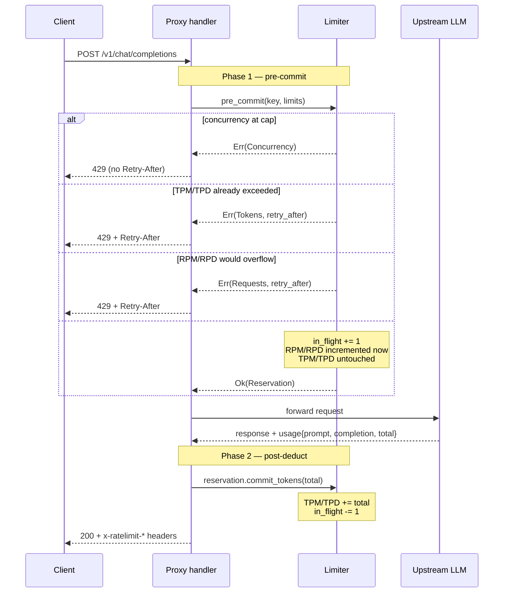

# Two-Phase Rate Limit

LLM rate limiting has a structural asymmetry that does not exist
in REST-API gateways: the cost of a request is split into two
parts that become knowable at different times.

- **Requests-per-minute / requests-per-day (RPM / RPD)** are
  knowable *before* dispatch — every accepted request consumes
  exactly one slot regardless of payload.
- **Tokens-per-minute / tokens-per-day (TPM / TPD)** are knowable
  only *after* dispatch — the upstream's `usage` block is the
  only authoritative source of `prompt_tokens +
  completion_tokens`. Estimating ahead is a known-broken pattern
  (provider tokenisers differ from any local tokeniser; reasoning
  models add hidden reasoning tokens; tool-call outputs bloat
  completion).
- **Concurrency** is independent of either: a hard cap on
  in-flight requests, enforced via an in-process semaphore-style
  counter.

The proxy resolves this with a **two-phase reservation pattern**:
phase 1 happens before the upstream call and commits RPM/RPD;
phase 2 happens after the upstream returns and commits TPM/TPD.
A `Reservation` guard ties the two phases together so that if
the request fails between them, the concurrency permit is still
released.

## The two phases



The module-level comment in
[`crates/aisix-ratelimit/src/limiter.rs:1-16`](https://github.com/api7/ai-gateway/blob/main/crates/aisix-ratelimit/src/limiter.rs#L1-L16)
states the contract verbatim, and the `Reservation` type
([`limiter.rs:249-253`](https://github.com/api7/ai-gateway/blob/main/crates/aisix-ratelimit/src/limiter.rs#L249))
makes the link between the two phases explicit at the type level
— a phase-1 success returns one of these handles, and the handle
is the only way to reach phase 2.

## Per-key state

Each rate-limit key (an API-key id, a `model:<name>` bucket, or a
policy-scope tuple) owns one `KeyState`
([`limiter.rs:32-50`](https://github.com/api7/ai-gateway/blob/main/crates/aisix-ratelimit/src/limiter.rs#L32)):

```rust
// Source has bare fields; the trailing comments are this page's gloss.
struct KeyState {
    rpm: FixedWindowCounter,    // 60s window, incremented in phase 1
    rpd: FixedWindowCounter,    // 86400s window, incremented in phase 1
    tpm: FixedWindowCounter,    // 60s window, incremented in phase 2
    tpd: FixedWindowCounter,    // 86400s window, incremented in phase 2
    in_flight: u32,             // concurrency, ++ in phase 1, -- in phase 2
}
```

States live in a `DashMap<String, Arc<Mutex<KeyState>>>` on the
`Limiter` ([`limiter.rs:77-100`](https://github.com/api7/ai-gateway/blob/main/crates/aisix-ratelimit/src/limiter.rs#L77)).
The hot path locks **one** mutex per request (the one for that
key); reads of other keys touch independent `DashMap` shards.
Every operation under the mutex is O(1) — increment, compare,
release.

This is deliberately in-process, not Redis. The cost of a
network round-trip per rate-limit check is roughly the same as
the upstream's TLS handshake; pushing it onto the hot path
defeats the purpose of running an in-process gateway. The
trade-off is documented in [What this design does not
do](#what-this-design-does-not-do) — counters are per-DP, not
fleet-wide, and multi-DP deployments lose cap precision
proportional to the fleet size.

## The fixed-window counter

`FixedWindowCounter` ([`crates/aisix-ratelimit/src/window.rs:18-23`](https://github.com/api7/ai-gateway/blob/main/crates/aisix-ratelimit/src/window.rs#L18))
is the workhorse:

```rust
pub struct FixedWindowCounter {
    window_secs: u64,    // 60 for RPM/TPM, 86400 for RPD/TPD
    window_start: u64,   // bucket boundary (unix seconds)
    count: u64,
}
```

`roll_if_stale`
([`window.rs:39-45`](https://github.com/api7/ai-gateway/blob/main/crates/aisix-ratelimit/src/window.rs#L39))
snaps the window to the nearest `window_secs` boundary on every
touch; if the bucket has changed, count goes to zero. This is
classic fixed-window, not sliding — we accept the 2× burst
window at boundaries in exchange for O(1) state.

Three operations:

| Method | Used by | Semantics |
|---|---|---|
| [`check_and_increment`](https://github.com/api7/ai-gateway/blob/main/crates/aisix-ratelimit/src/window.rs#L50) | RPM, RPD | atomic check + increment; returns `Full { retry_after_secs }` on overflow |
| [`add`](https://github.com/api7/ai-gateway/blob/main/crates/aisix-ratelimit/src/window.rs#L68) | TPM, TPD (phase 2) | unconditional increment; the usage is already paid for |
| [`is_exceeded`](https://github.com/api7/ai-gateway/blob/main/crates/aisix-ratelimit/src/window.rs#L97) | TPM, TPD (phase 1) | check-only; current window already over cap? reject |

The retry-after hint
([`window.rs:54-58`](https://github.com/api7/ai-gateway/blob/main/crates/aisix-ratelimit/src/window.rs#L54))
is `window_end - now`, clamped to at least 1 second so a client
that retries on a `Retry-After: 0` doesn't spin.

## Phase 1: pre-commit

`Limiter::pre_commit`
([`limiter.rs:171-243`](https://github.com/api7/ai-gateway/blob/main/crates/aisix-ratelimit/src/limiter.rs#L171))
runs every check under one mutex lock. The check order matters:

1. **Concurrency** — cheapest, never consumes a window slot. If
   `in_flight >= max`, return `RateLimitError::Concurrency` with
   no retry hint (a concurrency cap doesn't roll over a
   predictable boundary).
2. **TPM check-only** — if the previous minute's tokens already
   blew past the cap, refuse the new request before it even
   talks to the upstream. Same for TPD. The current request's
   tokens are not added yet.
3. **RPM check + increment** — atomic. If overflow, return
   `Requests` with a retry-after.
4. **RPD check + increment** — atomic. If overflow, **compensate
   by decrementing RPM**, then return.

The RPD compensation
([`limiter.rs:215-233`](https://github.com/api7/ai-gateway/blob/main/crates/aisix-ratelimit/src/limiter.rs#L215))
is subtle enough to warrant its own section.

### Why RPD rejection must decrement RPM, not reset it

The first version of this code reset the RPM counter on RPD
rejection — and that was a hard rate-limit bypass
([issue #109](https://github.com/api7/ai-gateway/issues/109)).
Scenario: two concurrent requests on the same key, both pass
RPM, both attempt RPD. One commits; the other hits RPD and
"compensates" by re-initialising the entire RPM counter to zero.
The first request's RPM slot is now lost; effectively the
attacker has earned back a full RPM window by tripping RPD.

The current code decrements RPM by exactly **1** — the increment
the current request just added — and `FixedWindowCounter::decrement`
([`window.rs:81-86`](https://github.com/api7/ai-gateway/blob/main/crates/aisix-ratelimit/src/window.rs#L81))
is window-aware: it only subtracts when `now` falls in the same
window as `window_start`. If the window has already rolled
between the increment and the compensation, the decrement is a
no-op — applying it to the fresh window would corrupt unrelated
counts.

Two regression tests pin this behaviour:
`decrement_reduces_current_window_count_only`
([`window.rs:175-190`](https://github.com/api7/ai-gateway/blob/main/crates/aisix-ratelimit/src/window.rs#L175))
and `decrement_is_noop_after_window_rollover`
([`window.rs:193-206`](https://github.com/api7/ai-gateway/blob/main/crates/aisix-ratelimit/src/window.rs#L193)).

## Phase 2: post-deduct

When the upstream returns successfully, the handler calls
`reservation.commit_tokens(total)`
([`limiter.rs:267-275`](https://github.com/api7/ai-gateway/blob/main/crates/aisix-ratelimit/src/limiter.rs#L267)):

```rust
pub fn commit_tokens(mut self, tokens: u64) {
    let now = self.limiter.clock.unix_secs();
    let state = self.limiter.state_for(&self.key);
    let mut s = state.lock();
    s.tpm.add(now, tokens);
    s.tpd.add(now, tokens);
    s.in_flight = s.in_flight.saturating_sub(1);
    self.committed = true;
}
```

Three things happen atomically under the per-key mutex:
- TPM and TPD are incremented by the actual usage.
- The concurrency permit is released.
- `committed = true` so the `Drop` impl doesn't double-release.

The non-streaming chat handler calls this directly
([`crates/aisix-proxy/src/chat.rs:906`](https://github.com/api7/ai-gateway/blob/main/crates/aisix-proxy/src/chat.rs#L906))
with the upstream's reported `total_tokens`. The streaming path
is different — it's the subject of [the next section](#streaming-the-deferred-phase-2).

### What happens on error between the two phases

If the request fails between `pre_commit` and `commit_tokens` —
upstream timeout, network reset, panic in a downstream task — the
`Reservation` is simply dropped without calling
`commit_tokens`. The `Drop` impl
([`limiter.rs:278-287`](https://github.com/api7/ai-gateway/blob/main/crates/aisix-ratelimit/src/limiter.rs#L278))
releases the concurrency permit:

```rust
impl<'a, C: Clock> Drop for Reservation<'a, C> {
    fn drop(&mut self) {
        if self.committed { return; }
        let state = self.limiter.state_for(&self.key);
        let mut s = state.lock();
        s.in_flight = s.in_flight.saturating_sub(1);
    }
}
```

What does **not** happen:
- The RPM increment is **not** rolled back. The caller did
  consume a slot — we offered the upstream a request, and the
  failure is operationally our concern, not the customer's
  budget concern. This is also the right behaviour against
  abuse: an attacker spinning failed requests doesn't get free
  RPM slots.
- TPM stays at 0 for this request. The upstream may have
  partially generated tokens (and billed for them), but the
  proxy never saw the count. This is an acknowledged
  under-counting case; in production it's invisible because
  failures are rare.

This is the cleanest available trade-off given that the proxy
cannot reliably observe how many tokens an upstream
generated before failing — and it explicitly avoids the
race-prone "compensate on failure" alternative.

## Streaming: the deferred phase 2

Streaming chat is the hard case. The upstream's `usage` block is
only present on the *terminal* SSE chunk, which can be tens of
seconds after pre-commit. Holding the concurrency permit for that
long would let a few slow streams permanently lock out the cap.

The streaming handler
([`chat.rs:519-581`](https://github.com/api7/ai-gateway/blob/main/crates/aisix-proxy/src/chat.rs#L519))
splits phase 2 into two halves:

1. **Immediately after upstream `chat_stream` succeeds**, capture
   the layer keys and **drop** the reservation
   ([`chat.rs:536-537`](https://github.com/api7/ai-gateway/blob/main/crates/aisix-proxy/src/chat.rs#L536-L537)):

   ```rust
   let post_stream_keys = reservation.keys();
   drop(reservation);
   ```

   The drop releases concurrency for every layer. RPM was
   already counted by pre-commit. TPM stays at 0.

2. **When the SSE stream terminates upstream** — i.e. the
   completion callback fires with the parsed usage block — the
   handler retroactively accounts for the tokens
   ([`chat.rs:577-579`](https://github.com/api7/ai-gateway/blob/main/crates/aisix-proxy/src/chat.rs#L577-L579)):

   ```rust
   for key in &post_stream_keys {
       limiter.add_tokens_post_stream(key, comp.total_tokens);
   }
   ```

   `add_tokens_post_stream`
   ([`limiter.rs:147-156`](https://github.com/api7/ai-gateway/blob/main/crates/aisix-ratelimit/src/limiter.rs#L147))
   is a tokens-only update that lazily initialises the per-key
   state if it has not been seen yet (e.g. first request after a
   restart), and is a no-op when `tokens == 0` (an empty stream
   doesn't pollute the table).

### Why this exists: issue #108

Before this fix, the streaming handler called
`reservation.commit_tokens(0)` immediately after dispatching the
stream — TPM was effectively disabled for all streaming traffic
([issue #108](https://github.com/api7/ai-gateway/issues/108)).
Since streaming is the majority of production LLM traffic, this
silently disabled the TPM cap for the dominant path.

The current design preserves the contract: TPM is enforced for
both streaming and non-streaming, and the *only* trade-off is
that streaming TPM is committed at end-of-stream rather than at
phase-1 time — which is the best any honest design can do
without estimating upstream tokenisation.

## Multi-layer reservations

A single request frequently has more than one applicable rate
limit:

| Layer | Key | Source |
|---|---|---|
| API-key inline | `auth.entry.id` | `ApiKey.rate_limit` field on the snapshot |
| Model inline | `model:<name>` | `Model.rate_limit` field on the snapshot |
| Policy (api_key / model / team / member scope) | `policy:<scope>:<scope_ref>:<entry_id>` | `rate_limit_policies` table on the snapshot |

`quota::reserve_layers`
([`crates/aisix-proxy/src/quota.rs:69-125`](https://github.com/api7/ai-gateway/blob/main/crates/aisix-proxy/src/quota.rs#L69))
walks all three layers, calling `pre_commit` for each that
applies, and packages the resulting reservations into a
`MultiReservation`
([`limiter.rs:289-312`](https://github.com/api7/ai-gateway/blob/main/crates/aisix-ratelimit/src/limiter.rs#L289)).
All layers use **AND** logic — any one rejection 429s the
request.

The wrapper is a thin guard: `commit_tokens(total)` walks every
layer and commits the same token count; `Drop` releases every
permit. The chat handler calls it via
`enforce_rate_limit`
([`quota.rs:148-154`](https://github.com/api7/ai-gateway/blob/main/crates/aisix-proxy/src/quota.rs#L148)).

Policy windows are translated to RPM/RPD on the fly by
`policy_to_rate_limit`
([`quota.rs:48-66`](https://github.com/api7/ai-gateway/blob/main/crates/aisix-proxy/src/quota.rs#L48)):
`second` scales by 60 to populate `rpm`; `minute` is direct;
`hour` scales by 24 to populate `rpd`. The KeyState struct
itself only stores minute and day counters — finer granularities
are an interpolation on top.

## Wire surface

### 429 response

A rate-limit rejection produces HTTP 429 via
`ProxyError::RateLimit`
([`crates/aisix-proxy/src/error.rs:106`](https://github.com/api7/ai-gateway/blob/main/crates/aisix-proxy/src/error.rs#L106))
mapping to `StatusCode::TOO_MANY_REQUESTS`
([`error.rs:123`](https://github.com/api7/ai-gateway/blob/main/crates/aisix-proxy/src/error.rs#L123)).
The body is a JSON envelope with `error.type =
"rate_limit_exceeded"`
([`error.rs:141`](https://github.com/api7/ai-gateway/blob/main/crates/aisix-proxy/src/error.rs#L141))
so clients can disambiguate from a 429 produced by an upstream
provider.

The `Retry-After` header is set
([`error.rs:166-179`](https://github.com/api7/ai-gateway/blob/main/crates/aisix-proxy/src/error.rs#L166))
when `RateLimitError::retry_after_secs`
([`crates/aisix-ratelimit/src/error.rs:33-43`](https://github.com/api7/ai-gateway/blob/main/crates/aisix-ratelimit/src/error.rs#L33))
returns `Some` — that is, for `Requests` and `Tokens` errors but
not for `Concurrency`, which is bursty and doesn't roll over a
calendar boundary.

### Status headers on success

Every successful chat response gets `x-ratelimit-*` headers
populated by `inject_ratelimit_headers`
([`crates/aisix-proxy/src/render.rs:145-192`](https://github.com/api7/ai-gateway/blob/main/crates/aisix-proxy/src/render.rs#L145-L192)),
called from the handler
([`chat.rs:144-146`](https://github.com/api7/ai-gateway/blob/main/crates/aisix-proxy/src/chat.rs#L144-L146))
*after* `commit_tokens` so the counters reflect the just-completed
request:

```
x-ratelimit-limit-requests:       N
x-ratelimit-remaining-requests:   N - used
x-ratelimit-reset-requests:       <seconds until next minute>s   # e.g. 47s
x-ratelimit-limit-tokens:         N
x-ratelimit-remaining-tokens:     N - used
x-ratelimit-reset-tokens:         <seconds until next minute>s   # e.g. 47s
x-ratelimit-limit-concurrent:     N                              # gateway extension
x-ratelimit-remaining-concurrent: N - in_flight                  # gateway extension
```

The `requests`, `tokens`, and `reset-*` headers follow OpenAI's
documented convention so OpenAI-SDK clients (which already parse
these) get rate-limit visibility without code changes. The
`concurrent` headers are a gateway-specific extension in the same
`x-ratelimit-*` namespace — OpenAI does not define a concurrency
header — added so the same SDK code path that watches the request
budget can also see in-flight slots. The reset values carry an
`s` suffix on the wire (`"47s"`, not `"47"`); the `format!("{}s",
…)` is in
[`render.rs:169`](https://github.com/api7/ai-gateway/blob/main/crates/aisix-proxy/src/render.rs#L169).
Only headers whose corresponding limit is configured (non-`None`)
are emitted; unconfigured limits stay absent rather than emitting
an `Inf` sentinel.

`Limiter::peek`
([`limiter.rs:107-131`](https://github.com/api7/ai-gateway/blob/main/crates/aisix-ratelimit/src/limiter.rs#L107))
is read-only — it rolls the windows for accurate "remaining"
math but never increments. A `peek` on a key that has never been
seen returns `None`, and the handler omits all the headers in
that case.

## Failure modes and observability

### Counters drift on per-DP basis under multi-replica fan-out

The counters are in-process. A two-DP deployment with a `rpm =
60` cap can in principle pass 120 requests in a minute if the
load balancer round-robins. There is no shared store. This is
the explicit trade-off for in-process latency.

Mitigations available today:
- **Stick to per-DP caps** that are 1/N of the desired global cap
  when running with N DPs. This is operator policy, not
  enforced by the gateway.
- **Use the policy layer** to scope different caps at api_key /
  team / member granularity, which reduces the blast radius of
  the per-DP error.
- **Future: distributed counter backend** is filed as a roadmap
  item but is not on the v1 path; per-DP precision has been
  sufficient for every workload we've seen.

### Counter eviction under churn

The `DashMap<String, Arc<Mutex<KeyState>>>` grows monotonically
during the process's lifetime. For a tenant with millions of
ephemeral API keys, this is a slow leak. The current build does
not evict — restart-on-deploy is the implicit GC. This is fine
for the gateway's deployment cadence (sub-daily) but is worth
revisiting if we ever need long-running stable processes.

### Clock injection for tests

`SystemClock`
([`crates/aisix-ratelimit/src/clock.rs:19-25`](https://github.com/api7/ai-gateway/blob/main/crates/aisix-ratelimit/src/clock.rs#L19))
is the production clock. Tests use `TestClock`
([`clock.rs:31-48`](https://github.com/api7/ai-gateway/blob/main/crates/aisix-ratelimit/src/clock.rs#L31))
which exposes `advance` / `set` on an `AtomicU64`. The clock is
injected via `Limiter::with_clock`
([`limiter.rs:95-100`](https://github.com/api7/ai-gateway/blob/main/crates/aisix-ratelimit/src/limiter.rs#L95))
so window-boundary behaviour can be tested deterministically
without `sleep`.

### Test coverage

The two regression issues #108 (streaming TPM bypass) and #109
(RPD rejection RPM bypass) both have regression tests in
[`limiter.rs:322-735`](https://github.com/api7/ai-gateway/blob/main/crates/aisix-ratelimit/src/limiter.rs#L322).
The window-arithmetic edge cases are covered in
[`window.rs:110-218`](https://github.com/api7/ai-gateway/blob/main/crates/aisix-ratelimit/src/window.rs#L110).
End-to-end isolation across callers is verified in
[`tests/e2e/src/cases/concurrency-e2e.test.ts`](https://github.com/api7/ai-gateway/blob/main/tests/e2e/src/cases/concurrency-e2e.test.ts).

## What this design does not do

- **No cross-replica coordination.** Each DP process owns its
  own counters. Multi-DP deployments must either accept the
  per-DP-multiplied effective cap or upstream the policy to a
  shared store outside the proxy. There is no Redis dependency,
  and adding one is a deliberate non-goal for the latency
  budget.
- **No pre-flight token estimation.** Even with a local
  tokeniser, the upstream's count is the only one that matters
  for billing and for matching the provider's own rate limits.
  We do not try to estimate `prompt_tokens` before dispatch.
  The implication is that a single request whose
  `completion_tokens` blows the TPM cap *will* succeed once,
  and only the *next* request gets refused. This is the
  documented and accepted asymmetry — it matches how the
  upstream LLMs behave themselves.
- **No sliding-window precision.** `FixedWindowCounter` is
  literally a fixed bucket. At a window boundary, a worst-case
  burst of `2 × limit` can pass within a couple of seconds. If a
  customer needs strict 60-second sliding windows, the policy
  layer can be set to `second` scope with `max_requests / 60` —
  at the cost of finer-grained reservation overhead.
- **No retroactive RPM rollback on upstream failure.** A request
  that consumed an RPM slot but failed mid-flight keeps the
  slot. This is by design — RPM is the "we offered the upstream
  a request" counter, not the "we successfully billed for a
  request" counter.

## Further reading

- **[Snapshot and Watch](snapshot-and-watch.md)** — the
  `RateLimit` and `RateLimitPolicy` configuration on the
  snapshot that every `pre_commit` call reads from.
- A sibling page, `protocol-translation.md` (forthcoming), covers
  how the streaming TPM completion fires from the SSE terminal
  chunk regardless of the upstream's native protocol.
- OpenAI's
  [rate-limit headers spec](https://platform.openai.com/docs/guides/rate-limits)
  — the request/token/reset header naming convention that
  `inject_ratelimit_headers` follows.
