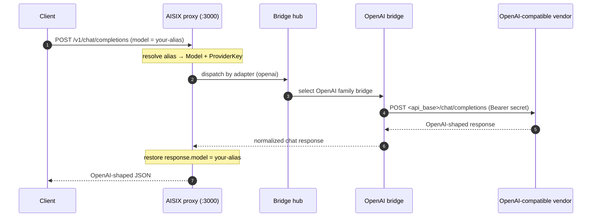

This guide shows how to onboard a public OpenAI-compatible vendor — DeepSeek, Groq, Mistral, Together.ai, Fireworks, Perplexity, and similar services — to AISIX AI Gateway. These vendors expose the OpenAI chat-completions wire at a known public host, so they all dispatch through the `openai` [adapter](../reference/adapters.md) family. Callers reach them through the same OpenAI-compatible proxy surface and the same caller API keys as any other model.

## When to use this

- Use this when the upstream is a **public** vendor that serves the OpenAI chat-completions API at a documented host (for example `https://api.deepseek.com` or `https://api.groq.com/openai/v1`).
- Use this in the **self-hosted** gateway, where you register the vendor's host and credential yourself through the admin API.
- In **AISIX Cloud**, you usually do not need this guide: the catalog maps these vendors to the `openai` adapter automatically when you select the provider. See [Catalog versus bring-your-own](#self-hosted-versus-cloud) below.

This page is distinct from two neighbors:

- [Bring your own endpoint](../configuration/byo-endpoint.md) covers **private or self-hosted** OpenAI-compatible servers (vLLM, SGLang, Ollama, an internal proxy). The mechanics are identical; the difference is that a BYO endpoint is yours and not on a public host.
- [OpenAI-compatible API](openai-compatible-api.md) documents the **client-facing** proxy surface — the API your callers use to reach the gateway. This page is about the **upstream** side: pointing the gateway at a vendor.

## How it works

An OpenAI-compatible vendor is configured through two resources, exactly like any other upstream:

1. A [provider key](../configuration/provider-keys.md) holding the vendor credential (`secret`), its base URL (`api_base`), the vendor identity (`provider`), and the wire shape (`adapter: openai`).
2. A direct [model](../configuration/models.md) that maps a caller-facing alias (`display_name`) to the vendor's model id (`model_name`) and references the provider key.

Because these are public vendors with a non-`openai` vendor identity, **you must set `api_base`**. The OpenAI-family bridge only falls back to `https://api.openai.com` when the provider key's vendor identity is `openai` (or empty). For any other vendor it refuses to guess a base URL and fails dispatch. Set `api_base` to the vendor's documented host.

Each vendor's canonical `api_base` form differs. DeepSeek serves the OpenAI-compatible paths at the host root; others use a `/v1` or `/openai/v1` prefix. The gateway tolerates common paste variants but does not synthesize a vendor-specific prefix — paste the form the vendor documents. See [Provider keys § `api_base` behavior](../configuration/provider-keys.md#api_base-behavior) for the full normalization rules.



## Prerequisites

- A running self-hosted gateway (admin on `:3001`, proxy on `:3000`). See the [Self-Hosted Quickstart](../quickstart/self-hosted.md).
- Your admin key from the bootstrap config.
- A vendor API key and the vendor's documented OpenAI-compatible host. The examples below use DeepSeek (`https://api.deepseek.com`, model id `deepseek-chat`).

## Configuration

### Step 1: Create the provider key

:::warning Production credentials
The standalone gateway stores `secret` as plaintext under the etcd `prefix` from [`config.yaml`](../configuration/bootstrap-config.md). For production, front etcd with encryption-at-rest, restrict etcd network access to the gateway, or use AISIX Cloud's managed [Provider Key Rotation](../cloud/provider-key-rotation.md), where the secret stays in the control plane and only the projected reference reaches the data plane.
:::

```bash title="Create a DeepSeek provider key"
curl -sS -X POST http://127.0.0.1:3001/admin/v1/provider_keys \
  -H "Authorization: Bearer YOUR_ADMIN_KEY" \
  -H "Content-Type: application/json" \
  -d '{
    "display_name": "deepseek-prod",
    "provider": "deepseek",
    "adapter": "openai",
    "secret": "YOUR_PROVIDER_API_KEY",
    "api_base": "https://api.deepseek.com"
  }'
```

Field notes:

- `provider` is the vendor identity, a free-form lowercase label (`deepseek`, `groq`, `mistral`, `together`, `fireworks`, `perplexity`). It is used for dispatch and metrics. It must not be `openai` unless you genuinely point at OpenAI.
- `adapter` pins the wire shape to `openai` — the only valid value for an OpenAI-compatible vendor.
- `api_base` is required. Use the vendor's documented host:

  | Vendor | Documented `api_base` |
  |---|---|
  | DeepSeek | `https://api.deepseek.com` (host root) |
  | Groq | `https://api.groq.com/openai/v1` |
  | Mistral | `https://api.mistral.ai/v1` |
  | Together.ai | `https://api.together.xyz/v1` |
  | Fireworks | `https://api.fireworks.ai/inference/v1` |
  | Perplexity | `https://api.perplexity.ai` |

  Confirm the exact host against the vendor's current API reference before relying on it.

Capture the returned `id` for the next step. The admin API returns a `ResourceEntry` with an `id` field; the [first-request quickstart](../quickstart/first-model-first-key-first-request.md#step-1-create-a-provider-key) shows a `jq`-capturing one-liner if you want to script it.

### Step 2: Create the model

Map a caller-facing alias to the vendor's model id.

```bash title="Create a model for the vendor"
curl -sS -X POST http://127.0.0.1:3001/admin/v1/models \
  -H "Authorization: Bearer YOUR_ADMIN_KEY" \
  -H "Content-Type: application/json" \
  -d '{
    "display_name": "deepseek-chat-prod",
    "provider": "deepseek",
    "model_name": "deepseek-chat",
    "provider_key_id": "YOUR_PROVIDER_KEY_ID"
  }'
```

- `display_name` is the alias callers send in `model` and the value `response.model` echoes back.
- `model_name` is the vendor's model id — the literal string the vendor expects in its `model` field.
- `provider` on the model is the same vendor label as on the key.
- `cost` is optional. Public vendors are not in the gateway's standalone pricing path, so set a `cost` block if you want per-token budget accounting available to AISIX Cloud or your own usage-event consumer. See [Models § field notes](../configuration/models.md#field-notes).

### Step 3: Create a caller API key

The data plane stores `key_hash`, not plaintext. Hash a plaintext caller key, then create the key resource scoped to your new alias.

```bash title="Hash a plaintext caller key"
printf 'sk-demo-caller' | sha256sum | cut -d' ' -f1
```

```bash title="Create a caller API key"
curl -sS -X POST http://127.0.0.1:3001/admin/v1/apikeys \
  -H "Authorization: Bearer YOUR_ADMIN_KEY" \
  -H "Content-Type: application/json" \
  -d '{
    "key_hash": "YOUR_CALLER_KEY_HASH",
    "allowed_models": ["deepseek-chat-prod"]
  }'
```

### Step 4: Send a request

Admin writes propagate to the proxy asynchronously; allow about a second, or poll `/v1/models` until the alias appears.

```bash title="Send a chat completion to the vendor"
curl -sS -X POST http://127.0.0.1:3000/v1/chat/completions \
  -H "Authorization: Bearer sk-demo-caller" \
  -H "Content-Type: application/json" \
  -d '{
    "model": "deepseek-chat-prod",
    "messages": [
      {"role": "user", "content": "Say hello from DeepSeek."}
    ]
  }'
```

## Self-hosted versus Cloud

The two modes differ only in where the field values come from:

- **Self-hosted** — you set `provider`, `adapter: openai`, `api_base`, and `secret` on the provider key yourself, exactly as shown above. The gateway ships no catalog.
- **AISIX Cloud** — the control plane ships a models.dev-driven catalog and maps each catalog provider to its adapter automatically. You select the provider in the dashboard; the adapter (`openai` for these vendors) and the base URL are filled in for you. See [Adapter protocol families § Catalog versus bring-your-own](../reference/adapters.md#catalog-versus-bring-your-own).

### Non-featured and Community providers

Within the AISIX Cloud catalog, a subset of providers is **featured** — the ranked set the dashboard surfaces first. A vendor that is in the catalog but not featured (a Community provider) still resolves to the `openai` adapter through the same catalog mapping; it is simply not promoted in the ranked list. Featured status affects discovery and presentation, not dispatch — both run through the same OpenAI bridge. In the self-hosted gateway there is no featured concept; every vendor you register is equal.

## Verification

A `200` alone does not prove the gateway reached the vendor and applied the alias contract. Verify the two observable facts that do.

### The alias is restored on `response.model`

```bash title="Confirm response.model echoes your alias"
curl -sS -X POST http://127.0.0.1:3000/v1/chat/completions \
  -H "Authorization: Bearer sk-demo-caller" \
  -H "Content-Type: application/json" \
  -d '{"model":"deepseek-chat-prod","messages":[{"role":"user","content":"ping"}]}' \
  | grep -o '"model":"[^"]*"'
```

Expected: `"model":"deepseek-chat-prod"` — your caller-facing alias, **not** the upstream `deepseek-chat`. This proves the request resolved through your model and the gateway restored the alias on the way out. If you see the vendor's model id instead, the request did not flow through the gateway's render path.

### The request actually reached the vendor

Confirm dispatch targets your configured `api_base` and not a default host. Temporarily point `api_base` at an unreachable host and confirm the gateway returns an upstream error rather than a `200`:

```bash title="Negative check — unreachable host surfaces an upstream error"
curl -sS -o /dev/null -w "%{http_code}\n" -X POST http://127.0.0.1:3000/v1/chat/completions \
  -H "Authorization: Bearer sk-demo-caller" \
  -H "Content-Type: application/json" \
  -d '{"model":"deepseek-chat-prod","messages":[{"role":"user","content":"ping"}]}'
```

With a healthy vendor host, expect `200`. With `api_base` pointing at a dead host, expect a `5xx` upstream error — confirming dispatch uses your `api_base` and not a built-in default. An authentication failure (`401`) instead of a successful response usually means the `secret` is wrong for the vendor.

## Limitations

- This path is for vendors that speak the OpenAI chat-completions wire. A vendor with a non-OpenAI wire shape needs a native adapter — see [Adapter protocol families](../reference/adapters.md).
- A missing `api_base` on a non-`openai` vendor fails dispatch with a configuration error. Always set `api_base`.
- Vendor-specific response extensions beyond the OpenAI envelope are not normalized. Reasoning-style fields can be lifted per key via the `response.reasoning_field` override; see [Provider key schema § response overrides](../reference/runtime-config-schema.md#response-overrides).

## Related pages

- [Adapter protocol families](../reference/adapters.md) — why an OpenAI-compatible vendor uses the `openai` adapter.
- [Bring your own endpoint](../configuration/byo-endpoint.md) — the same mechanics for a private or self-hosted endpoint.
- [Provider keys](../configuration/provider-keys.md) — the credential resource and the full `api_base` normalization rules.
- [Provider key schema](../reference/runtime-config-schema.md) — the complete field reference.
- [OpenAI-compatible API](openai-compatible-api.md) — the client-facing proxy surface callers use to reach the vendor.
