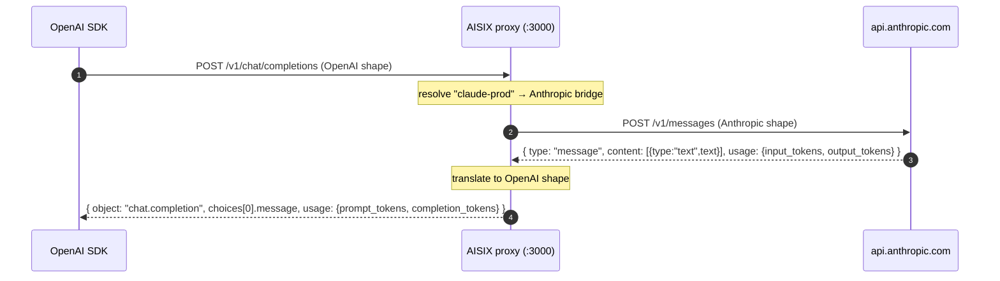

This tutorial wires an OpenAI-compatible client to an Anthropic upstream model. The caller speaks OpenAI Chat Completions; the gateway speaks Anthropic Messages to the upstream; the gateway returns an OpenAI-shaped response back to the caller.

You end with one direct model `claude-prod` that an existing OpenAI SDK can call as if it were `gpt-*` — provider selection lives in the gateway, not in the client.

## Prerequisites

- A running gateway from the [Self-Hosted Quickstart](../quickstart/self-hosted.md)
- An Anthropic API key
- A caller API key from the [First Model, First Key, First Request](../quickstart/first-model-first-key-first-request.md) quickstart, with `claude-prod` in `allowed_models` (or `["*"]`)

## How It Works



The caller never touches the Anthropic wire shape. The gateway also translates `usage` token counters and `stop_reason` → `finish_reason` so cost accounting works through the same OpenAI-shaped consumer.

## Step 1: Create The Anthropic Provider Key

:::caution Bare api_base for Anthropic
The Anthropic bridge appends `/v1/messages` to `api_base` itself. Set `api_base` to the **bare host** without `/v1`. This is opposite to the OpenAI bridge convention, where `api_base` should include `/v1`.
:::

```bash title="Create the Anthropic provider key"
curl -sS -X POST http://127.0.0.1:3001/admin/v1/provider_keys \
  -H "Authorization: Bearer YOUR_ADMIN_KEY" \
  -H "Content-Type: application/json" \
  -d '{
    "display_name": "anthropic-prod",
    "secret": "YOUR_ANTHROPIC_API_KEY",
    "api_base": "https://api.anthropic.com"
  }'
```

Capture the returned `id` as `ANTHROPIC_PK_ID`.

## Step 2: Create The Model Backed By Anthropic

```bash title="Create the claude-prod model"
curl -sS -X POST http://127.0.0.1:3001/admin/v1/models \
  -H "Authorization: Bearer YOUR_ADMIN_KEY" \
  -H "Content-Type: application/json" \
  -d '{
    "display_name": "claude-prod",
    "provider": "anthropic",
    "model_name": "claude-3-5-haiku-20241022",
    "provider_key_id": "ANTHROPIC_PK_ID"
  }'
```

- `provider: "anthropic"` selects the Anthropic bridge at dispatch time.
- `model_name` is the upstream model identifier — what the gateway sends to Anthropic. Verify the exact value in the [Anthropic Messages API reference](https://docs.anthropic.com/en/api/messages).

Wait for the snapshot to propagate:

```bash title="Wait for propagation"
sleep 1
```

If Step 3 returns `404 model_not_found`, propagation is still in flight. See [Wait for configuration propagation](../quickstart/first-model-first-key-first-request.md#step-4-wait-for-configuration-propagation) for the polling alternative.

## Step 3: Call It With An OpenAI SDK

The caller does not change provider, base URL, or request shape relative to a normal OpenAI gateway call. Only `model` changes — it is now the gateway alias `claude-prod`.

```js title="anthropic-via-openai-sdk.mjs"
import OpenAI from "openai";

const client = new OpenAI({
  apiKey: process.env.AISIX_API_KEY,        // sk-demo-caller
  baseURL: "http://127.0.0.1:3000/v1",
});

const completion = await client.chat.completions.create({
  model: "claude-prod",
  messages: [{ role: "user", content: "Say hello." }],
});

console.log(completion.choices[0]?.message.content);
console.log("usage:", completion.usage);
```

Run with:

```bash title="Run the OpenAI SDK example"
AISIX_API_KEY=sk-demo-caller node anthropic-via-openai-sdk.mjs
```

## Step 4: Verify The Translation

The response object is OpenAI-shaped. Check the published wire properties so you have proof the translation worked, not just that the call returned `200`:

- `completion.object === "chat.completion"`
- `completion.choices[0].message.role === "assistant"`
- `completion.choices[0].message.content` is the text content from Anthropic's `content[0].text`
- `completion.usage.prompt_tokens` is Anthropic's `input_tokens`
- `completion.usage.completion_tokens` is Anthropic's `output_tokens`
- `completion.usage.total_tokens` is the sum

If you prefer raw HTTP and want to inspect the response body directly:

```bash title="Raw curl version"
curl -sS -X POST http://127.0.0.1:3000/v1/chat/completions \
  -H "Authorization: Bearer sk-demo-caller" \
  -H "Content-Type: application/json" \
  -d '{
    "model": "claude-prod",
    "messages": [{"role":"user","content":"Say hello."}]
  }'
```

You should see a single OpenAI-shaped chat-completions object — no Anthropic-shaped fields leak through.

## What Just Happened

1. The OpenAI SDK sent a Chat Completions request to the gateway proxy `:3000`.
2. The proxy resolved `claude-prod` to the model in the snapshot, looked up its `provider: "anthropic"`, and dispatched through the Anthropic bridge.
3. The Anthropic bridge translated the OpenAI request shape into an Anthropic Messages request and POSTed it to `https://api.anthropic.com/v1/messages` (the bare `api_base` + bridge-appended path).
4. Anthropic returned an Anthropic-shaped response with `content: [{type:"text",text}]` and `usage: {input_tokens, output_tokens}`.
5. The bridge translated that back to an OpenAI chat-completion envelope with `choices[0].message.content` and `usage: {prompt_tokens, completion_tokens, total_tokens}`.

The same path is exercised by `tests/e2e/src/cases/anthropic-upstream-e2e.test.ts`, which mocks an Anthropic upstream and asserts the round-trip wire-shape translation in both directions.

## Cleanup

```bash title="Delete the tutorial resources"
curl -sS -X DELETE http://127.0.0.1:3001/admin/v1/models/CLAUDE_PROD_ID \
  -H "Authorization: Bearer YOUR_ADMIN_KEY"
curl -sS -X DELETE http://127.0.0.1:3001/admin/v1/provider_keys/ANTHROPIC_PK_ID \
  -H "Authorization: Bearer YOUR_ADMIN_KEY"
```

## Variations And Next Steps

- **Add a routing model on top** — combine an OpenAI-backed direct model and `claude-prod` under one virtual alias and let the gateway pick between them. See [Build A Virtual Model With Failover](build-a-virtual-model-with-failover.md).
- **Use the Anthropic-style endpoint directly** — `POST /v1/messages` exposes the Anthropic shape end-to-end without translation. See [Anthropic SDK Quickstart](../quickstart/anthropic-sdk.md).
- **Cover other providers the same way** — `provider: "google"` and `provider: "deepseek"` use the same pattern. The bridges handle their own wire translation; the caller stays on OpenAI Chat Completions.

## Related Pages

- [Models](../configuration/models.md) — direct model field reference, including the four supported `provider` values
- [Provider Keys](../configuration/provider-keys.md) — `api_base` conventions per provider
- [Anthropic Messages](../integration/anthropic-messages.md) — the Anthropic-shaped endpoint surface and current translation boundaries
- [OpenAI-Compatible API](../integration/openai-compatible-api.md) — what gets normalized and what is forwarded as-is
